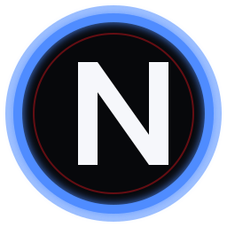
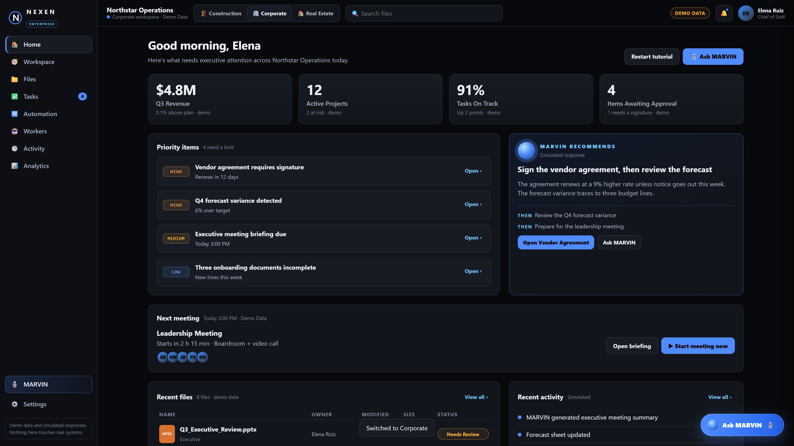
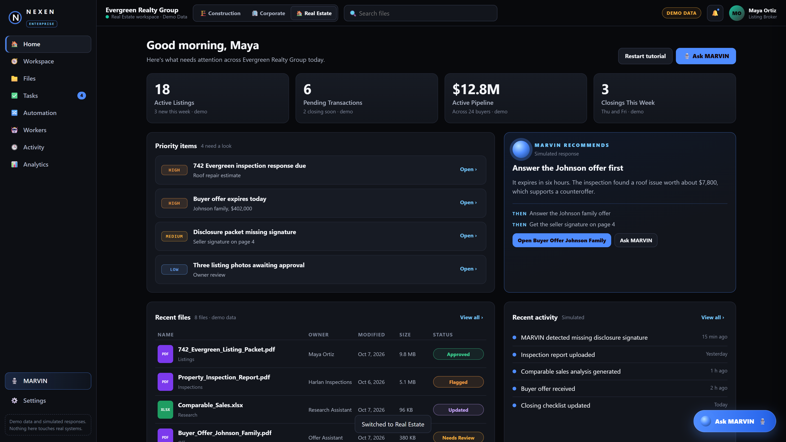
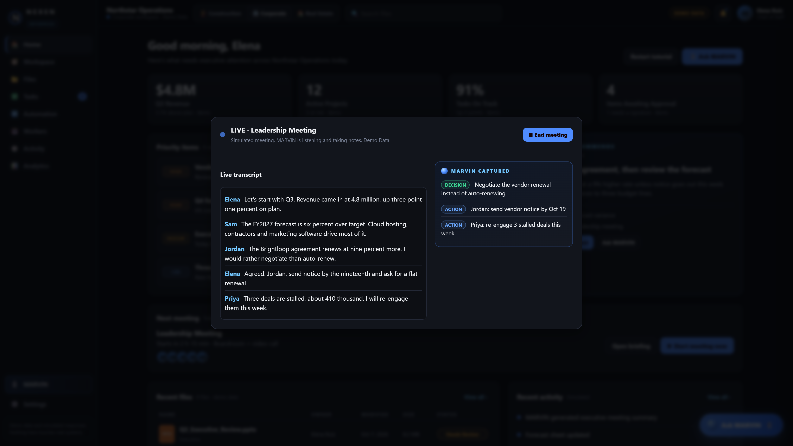
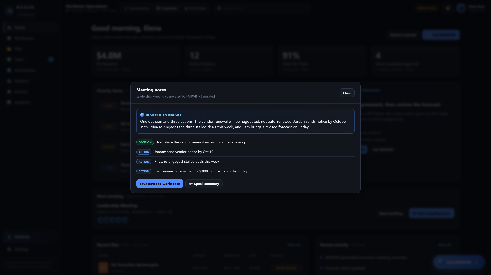
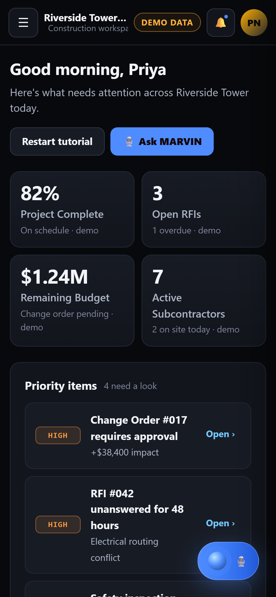
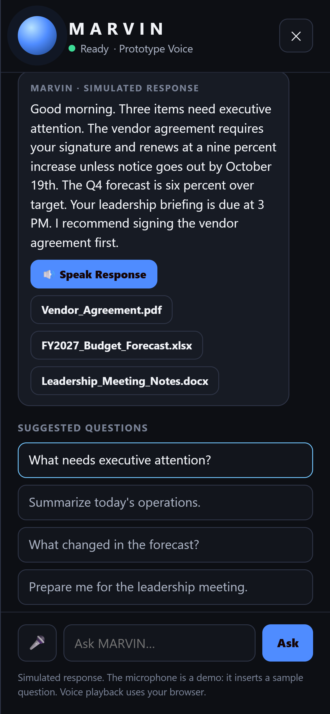

<p align="center">
  
</p>

<h1 align="center">NEXEN ENTERPRISE</h1>

<p align="center"><strong>Your Business. Connected. Intelligent. Executable.</strong></p>

<p align="center">One operating workspace for files, priorities, automation, AI workers, and MARVIN.</p>

<p align="center">
  
  
  
  
</p>

---

<p align="center">
  
</p>

## See the product, not the plumbing

NEXEN ENTERPRISE is a premium business-operations demo showing one NEXEN shell adapting to three different operating environments:

| Construction | Corporate | Real Estate |
|---|---|---|
|  |  |  |
| RFIs · change orders · safety · site operations | meetings · budgets · vendors · executive operations | listings · offers · inspections · disclosures · closings |

The shell stays consistent. The operating context changes.

**MARVIN** sits across the experience as the operator-facing AI interface: open the workspace, see what matters, inspect the evidence, and ask what to do next.

> **Demo truth:** this repository uses demo data, simulated responses, prototype browser voice, and clearly labeled future-development concepts. Mocked capabilities are not represented as live production integrations.

## MARVIN

<p align="center">
  
</p>

In the current demo MARVIN can:

- surface the highest-priority operational items,
- summarize context-specific mock documents,
- answer industry-aware scripted questions,
- demonstrate microphone interaction and browser speech,
- participate in the simulated Corporate meeting flow.

## Business event → useful outcome

| Meeting briefing | Live capture | Structured follow-up |
|---|---|---|
|  |  |  |

This demonstrates the core UX principle: **the complexity belongs in the engine, not in the interface.**

## Responsive product

| Mobile workspace | Mobile MARVIN |
|---|---|
|  |  |

Verified layouts include 1920×1080 desktop, 1366×768 laptop, and 390×844 mobile/narrow.

## Watch it

**[▶ NEXEN ENTERPRISE guided tutorial](https://github.com/dbgamerboy/NEXEN-ENTERPRISE/releases/download/demo/NEXEN-ENTERPRISE-tutorial.mp4)**

**[▶ NEXEN ENTERPRISE cinematic teaser](https://github.com/dbgamerboy/NEXEN-ENTERPRISE/releases/download/demo/NEXEN-ENTERPRISE-teaser.mp4)**

The teaser is built with **Remotion + Playwright + FFmpeg** using deterministic captures of the actual frontend rather than replacement mock UI.

## Verified demo state

| Check | Result |
|---|---:|
| Python backend suite | **24 / 24 PASS** |
| Browser product QA | **106 / 106 PASS** |
| Exhaustive buttons + checkboxes | **514 / 514 PASS** |
| Browser/page errors in exhaustive sweep | **0** |
| Broken asset/request failures in browser QA | **0** |

Evidence: [`docs/DEMO-RECEIPT.md`](docs/DEMO-RECEIPT.md)

## Start locally

```bash
python backend/server.py
```

Open:

```text
http://127.0.0.1:8794/
```

The frontend is also static-friendly and can be opened directly from `frontend/index.html`.

## Verify

```bash
python -m unittest discover -s tests -v
node tests/demo_qa.js
node tests/demo_buttons.js
node tools/demo_receipt.js
```

Generated QA screenshots are written under `docs/img/` locally and are intentionally not stored in Git.

## Canonical repository

```text
frontend/        one customer-facing product
backend/         bounded local demo server / API
docs/            source of truth + verification evidence
tests/           backend + browser verification
tools/           reproducible demo / receipt tooling
teaser/          Remotion source + deterministic product captures
.github/         CI + Pages deployment
```

Normal fixes happen **in place**. Git stores history. Theme changes, metadata fixes, GUI polish, responsive fixes, and documentation updates do not create parallel product trees.

## Platform thesis

The broader NEXEN model is:

```text
USER
  ↓
MARVIN
  ↓
NEXEN HARNESS / CONTROL PLANE
  ↓
AI · PRODUCTS · WORKFLOWS · WINDOWS AUTOMATION · APIs · WORKERS
  ↓
BUSINESS / PERSONAL CONTEXT
  ↓
RESULTS · EVIDENCE · ALERTS · DECISIONS
```

Standalone products do not need to be rewritten into NEXEN. They can remain powerful independent products and expose a contract that NEXEN can discover, govern, invoke, and present through MARVIN.

Personal NEXEN and public NEXEN are intentionally different:

- **Personal NEXEN** is the high-power internal command center.
- **Public NEXEN** productizes proven capabilities into clear customer experiences.
- **NEXEN LYFE** represents the personal schedule / routine / priority operating context in the broader platform thesis.

## Source of truth

For product boundaries, harness architecture, MARVIN’s role, anti-spaghetti rules, media direction, verification policy, and productization principles:

**[NEXEN ENTERPRISE — SOURCE OF TRUTH](docs/NEXEN-ENTERPRISE-SOURCE-OF-TRUTH.md)**

---

<p align="center">
  <strong>NEXEN ENTERPRISE</strong><br>
  One product. One canonical frontend. One canonical URL. Git owns history.
</p>
