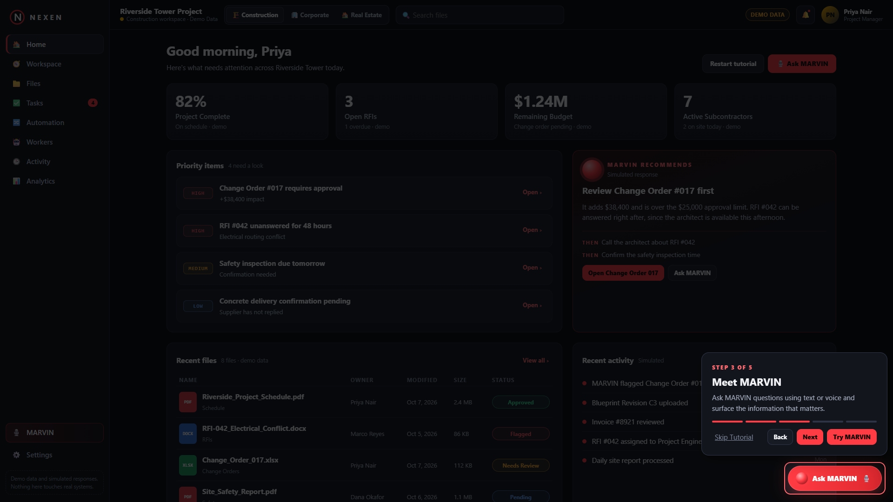
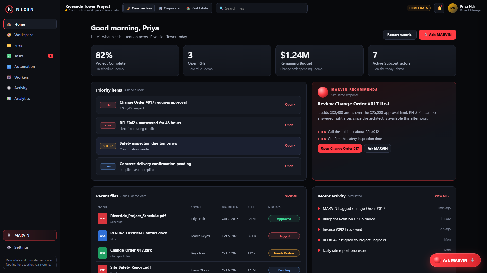
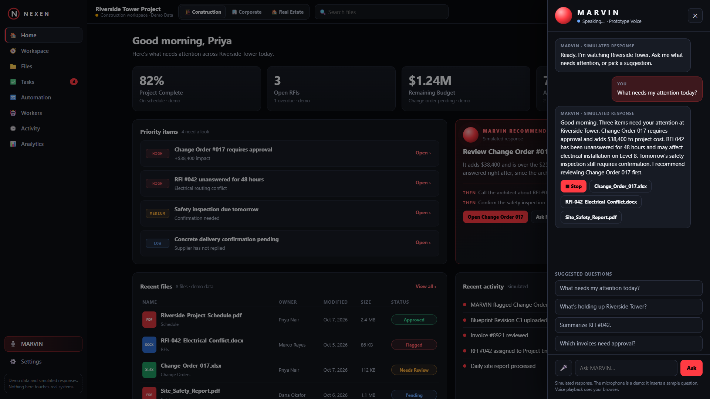

# NEXEN workspace demo: guide

Open `http://127.0.0.1:8794/v2/` after `python backend/server.py` (or open `frontend/v2/index.html` directly). All data is demo data and every MARVIN answer is simulated.

## The 90 second demo

| Time | Do this | Viewer sees |
|---|---|---|
| 0:00 | Open the page | NEXEN landing with three industry cards |
| 0:05 | Click **ENTER WORKSPACE** on Construction | The 5-step tutorial, then the Riverside Tower dashboard |
| 0:20 | Click the HIGH item "RFI #042 unanswered" | A file preview with a MARVIN Summary and related files |
| 0:30 | Click **Ask MARVIN** | The MARVIN drawer, status Ready |
| 0:35 | Click the 🎤 button | Listening, waveform, then the scripted question |
| 0:40 | MARVIN answers | Three items need attention. Press **🔊 Speak Response** to hear it |
| 0:55 | Click **Corporate** in the top bar | A different workspace: Northstar Operations |
| 1:05 | Click **Real Estate** | Evergreen Realty Group |
| 1:15 | Scroll to **FUTURE DEVELOPMENT** | Three concept cards, labeled as not shipped |
| 1:25 | Stop on the NEXEN logo | Click the logo to return to the landing |

## What each part does

| Part | What it does |
|---|---|
| Industry switch (top bar) | Changes the whole workspace: name, KPIs, priorities, files, workers, activity, MARVIN answers |
| Search | Filters the file list |
| Bell | Shows the priority items as notifications |
| Home | Dashboard: KPIs, priority items, MARVIN recommendation, recent files, activity, workers, future section |
| Files | All 8 files with owner, date, category, size, status. Filter by category. Click a file to preview |
| Tasks | Open tasks with checkboxes. The badge counts what is left |
| Automation, Workers | Simulated workflows and workers with their status |
| Activity, Analytics | Full activity feed and a status breakdown |
| Ask MARVIN | Opens the assistant. Suggested questions, text input, simulated microphone, Speak Response |
| Settings or the avatar | Restart the tutorial or return to the landing |

## Tutorial

Five steps with Back, Next, Skip Tutorial and Try MARVIN. It opens on first visit and can be restarted from Restart tutorial, Settings, or the landing link.

| Welcome | Workspace | MARVIN |
|---|---|---|
|  |  |  |

## Screenshots

Desktop 1920x1080: [landing](img/v2/01-landing-1080p.png), [Construction](img/v2/03-construction-home-1080p.png), [Corporate](img/v2/03-corporate-home-1080p.png), [Real Estate](img/v2/03-real-estate-home-1080p.png), [file preview](img/v2/04-construction-file-preview.png), [MARVIN listening](img/v2/06-marvin-listening.png), [future development](img/v2/07-future-development.png).
Phone 390x844: [landing](img/v2/09-narrow-landing.png), [home](img/v2/11-narrow-home.png), [menu](img/v2/12-narrow-menu.png), [MARVIN](img/v2/13-narrow-marvin.png).

Evidence for every claim is in [DEMO-RECEIPT.md](DEMO-RECEIPT.md).
