# NEXEN Demo Build: button tutorial

Every button below works in the demo on **sample data**. Highlighted frames are generated from the live UI by `tools/build_docs.js`, so they match the build.

**Try it in the app:** press **▶ Tutorial** (top right) for a guided spotlight tour, or **Highlight all** to outline and number every button.

| View | Image |
|---|---|
| 1080p desktop, three screens side by side | 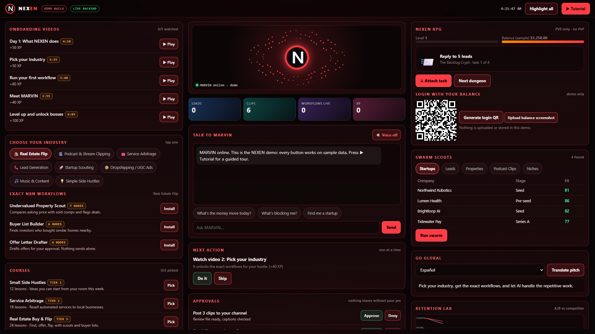 |
| 1080p with every button highlighted | 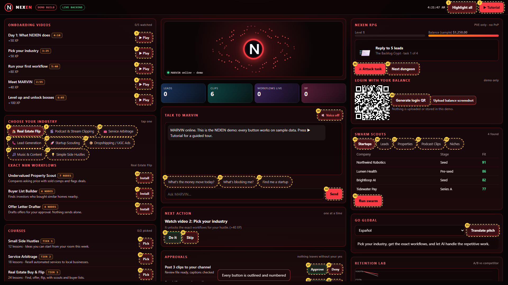 |

**Phone:** one screen at a time. Use the **side arrows** (‹ ›), swipe, or the bottom tab bar.

| LAUNCH | MARVIN | GROW | All buttons highlighted |
|---|---|---|---|
| 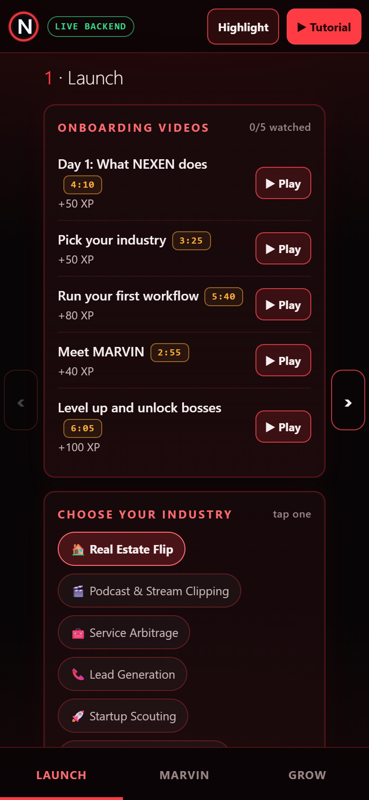 | 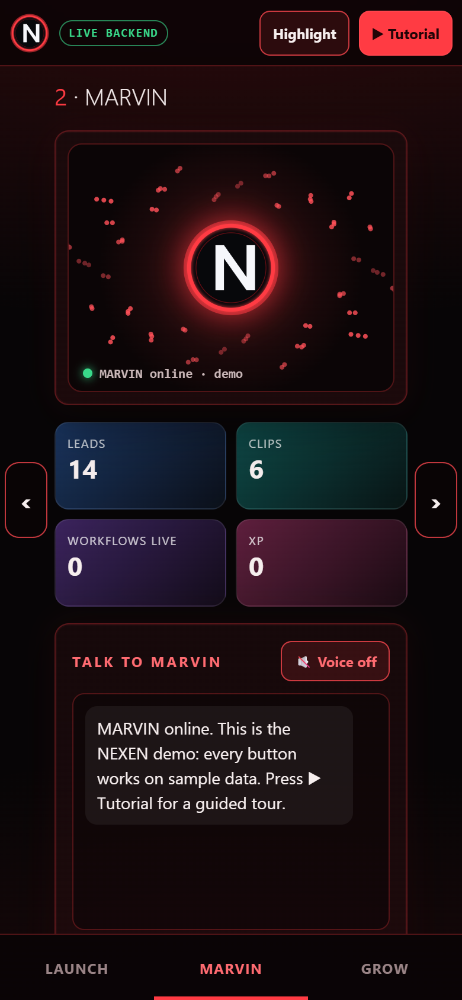 | 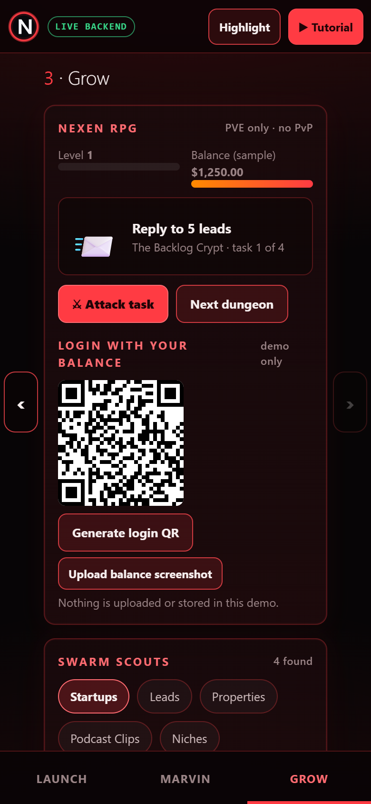 | 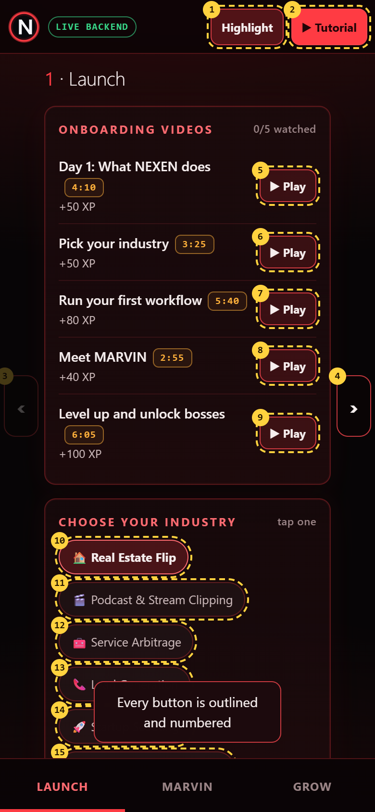 |

## Header and navigation

### 1. Tutorial

Starts this guided tour. Each button is spotlighted with a note on what it does.

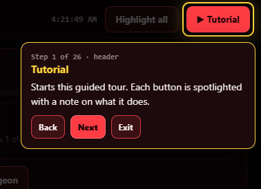

### 2. Highlight all

Outlines and numbers every clickable button on all three screens at once. Press again to hide.

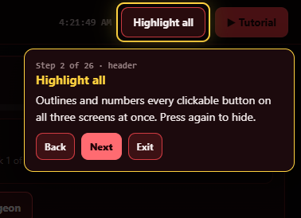

### 3. Side arrows

On phones and small windows the three screens sit side by side. The side arrows slide to the next or previous screen.

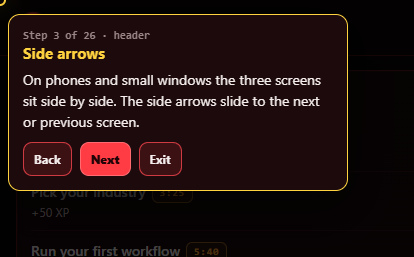

## Screen 1 · LAUNCH (learn, pick, install)

### 4. Play onboarding video

Opens the first onboarding video. Watch it and press Mark watched to earn XP.

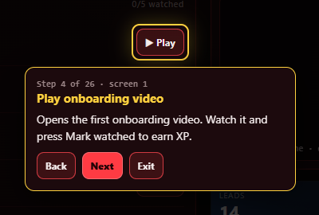

### 5. Choose your industry

Pick an industry chip. The list below changes to the exact n8n workflows for that industry.

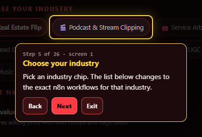

### 6. Install workflow

Adds the workflow to your Installed list and the Workflows live counter.

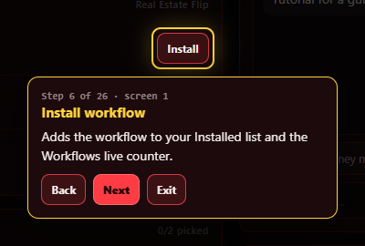

### 7. Pick a course

Courses come prebundled. Pick any 2 of the 3 tiers. The third locks until you swap.

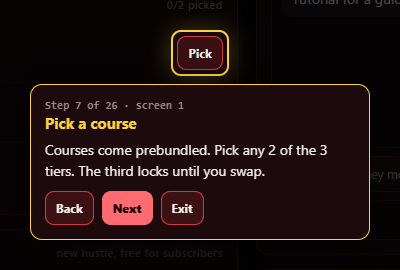

### 8. Monthly vote

Vote for the next hustle added to the subscription for free. One vote per month, bars update live.

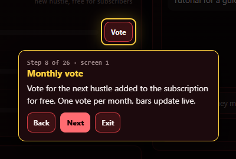

### 9. Plan perks

Switch between Starter, Pro and Denizen to see the perks. Subscribe is a demo and charges nothing.

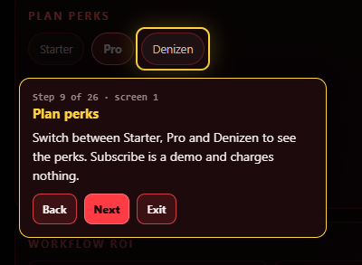

### 10. Score workflow

Runs the Golden Math: profit, ROI and repeatability decide Scale, Hold or Kill. Uses the live backend when it is running.

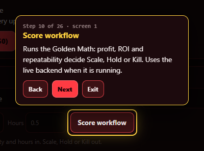

## Screen 2 · MARVIN (command center)

### 11. MARVIN voice

Toggles spoken replies. MARVIN reads each answer out loud and announces boss kills.

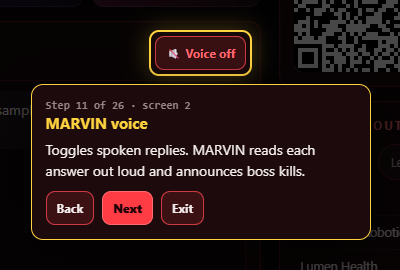

### 12. Send to MARVIN

Sends your question. MARVIN answers from the sample data in this demo.

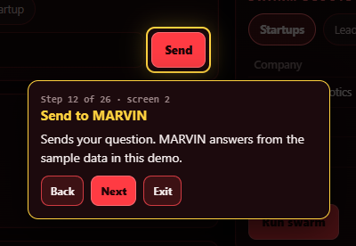

### 13. Quick question

One tap questions: money move today, what is blocking me, find a startup.

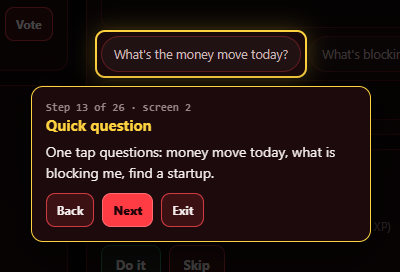

### 14. Do it

Completes the one next action MARVIN gave you, awards XP and shows the next step.

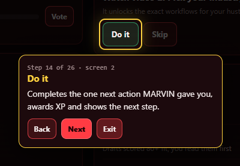

### 15. Approve

Anything that posts, sends or spends waits here. Approve or Deny with one tap.

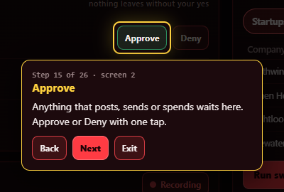

### 16. Agent recording

Starts or pauses the live feed that shows what the agents are doing right now.

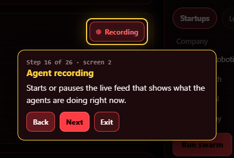

### 17. Run workflow

Runs an installed workflow and streams its steps into the log, ending with a result.

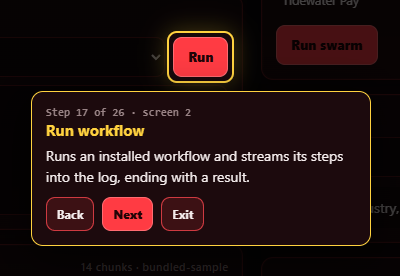

### 18. Brain search

Searches the vector database. Live backend uses your vector DB, otherwise the bundled sample.

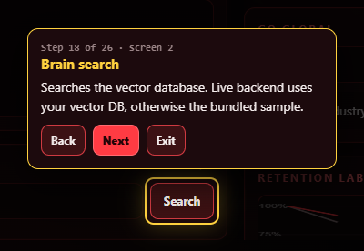

## Screen 3 · GROW (game, swarm, global)

### 19. Attack task

Each hit finishes one task in the dungeon. The last hit on the boss is a critical strike that unlocks a workflow.

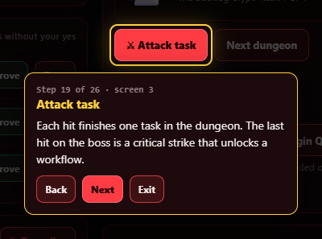

### 20. Login QR

Shows the demo QR pattern used to log into the game. Real login is not part of the demo.

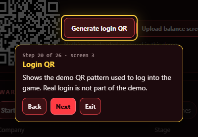

### 21. Swarm tabs

Switch scouts: startups, leads, properties, podcast clips, niches.

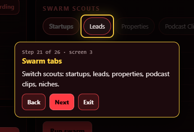

### 22. Run swarm

Sends the scouts out and refreshes the table with new sample finds.

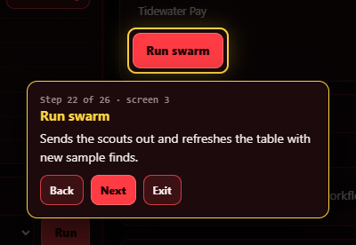

### 23. Translate pitch

Translates the pitch into the language you pick. 7 languages in the demo.

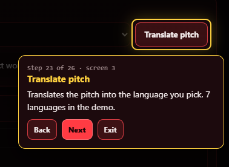

### 24. Run A/B test

Draws retention curves for your video against a competitor and shows the lift.

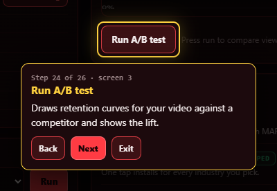

### 25. Preview VR room

Opens a preview of the 2027 VR home with your goals floating in the room.

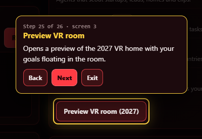

### 26. Denizen mode

Turns on Denizen. Agent counts and feed speed double, so you see the swarm at full power.

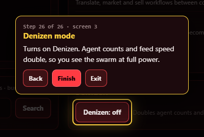

---
All numbers, names and results in the demo are sample data for demonstration. They are not results or earnings claims.
